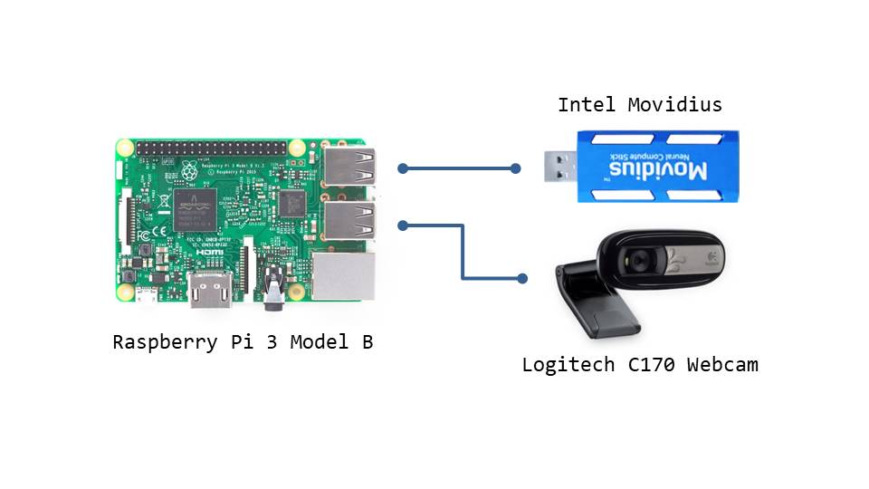

# AIoT: Raspberry Pi 3 B + Intel Movidius

We integrate Raspberry Pi 3 Model B and Intel Movidius to a AIoT prototype architecture. We demostrate how to use this integrated devices to do deep learning, iot, and AI projects.

* Reference:
  * Sophia Project : https://sophia.ddns.net/

## Architecture

The following is the basic AIoT architecture.

The following is the map of all pins in raspberry pi 3 model b.

## Content

* Raspberry Pi Model B
  * Environment Settings
* [Movidius Neural Compute Stick](movidius/README.md)
  * [Tensorflow](README.md)
* Video Streaming
  * [mjpg_streamer](mjpg_streamer/README.md)
  * [ffmpeg](ffmpeg/README.md)

